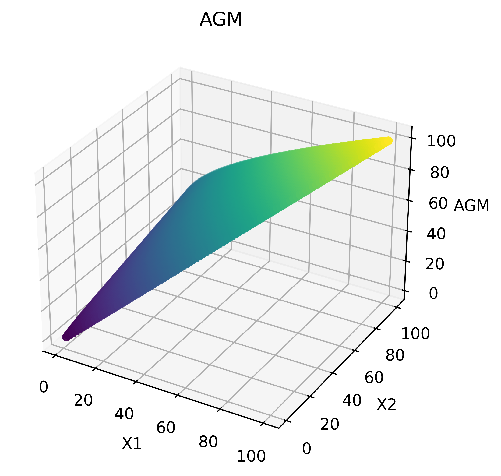

# Arithmetic Geometric Mean

The arithmetic-geometric mean agm(a,b) of two numbers a and b (often also written AGM(a,b) or M(a,b)) is defined by starting with a_0=a and b_0=b, then iterating

a_(n+1)	=	1/2(a_n+b_n)	
b_(n+1)	=	sqrt(a_nb_n)	

until a_n=b_n to the desired precision.

## 3D Scatter Plot

